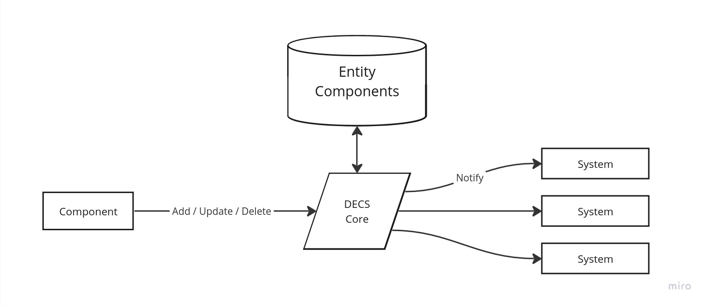
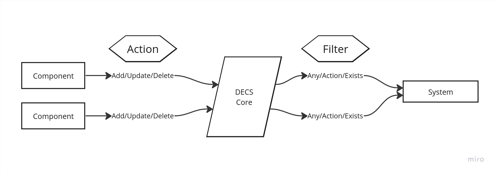

# Distributed Entity Component System (DECS)

A proposal & prototype of an [Entity Component System (ECS)](https://en.wikipedia.org/wiki/Entity_component_system) that is running on multiple machines.
The core idea is an aggregation-aware event broker that does all the heavy lifting of aggregating states across microservices by introducing entity components.

## Introduction

One of the key challenges of modern microservices environments is the dilemma of stability versus development speed.
Maintainers and developers alike have to carefully design their applications to prevent unwanted breaking changes and invalid states while still ensuring frequent deliveries of new features.
Architectures are carefully designed to ensure this by decoupling microservices in a failsafe way.
One approach are asynchronous event & message brokers to decouple the integration of services and to buffer work in queues.
This comes at the cost of the accepted inconsistent state across the distributed system.

The big downside of this asynchronous and inconsistent state is that it makes the event aggregation of changes across the distributed system difficult.
Naive approaches consist of polling the state from multiple services to aggregate the state.
But in most cases the services themself have to come up with a custom solution which often ends up in a hard coupling to dependencies.
This not only generates computational overhead and traffic, but also complexity and develpment overhead in those services.
It restricts the independent development, resilience and evolution of any microservice environment.

In recent years a new pattern named [Entity Component System (ECS)](https://en.wikipedia.org/wiki/Entity_component_system) has been established and adopted in game development.
ECS game engines reduce the integration effort by decoupling the state from the entity itself and introducing statefull components.
An entity can be anything and it's behavior is only defined by the attached statefull components.
A behavior is implemented in a system which can require multiple components to exist.
This solves the complexity problem of developing independent features on aggregated states without breaking or depending on other systems.

The idea of a DECS is to bring the ECS pattern to distributed systems in the cloud.
It shifts the place of statefull event aggregation from the microservies (aka "system") to the event broker by adding the concept of entities and components.
The core of a DECS is an event broker that applies the concepts of entities, components and systems to correlate events.
A DECS entity is a unique collision-free key that can be used for that correlation.
In theory a component can be anything, a reference to a service or entity, or a statefull document.
To ensure the stability of microservices the components can be protected by data contracts (specificiations) and versioning.
Services can subscribe to sets of components and only receive the aggregation of the subscribed components.
Additionally, this concept could be extended by authentication layers and RBAC policies.

DECS should help big & small organizations to decouple services to allow a more natural & integrated evolution.
It could be one of the missing pieces for a true data mesh.

## Prototype
work in progress

### Design
The following is preliminary design & thoughts that are NOT final.

#### Entity State
The DECS core event broker must somehow match the component to an entity and store that state in some database. 
Additionally or alternatively the state may be stored in a System (yet to be decided...).

When a component is added, updated or deleted the DECS core is notified by an event and persist the state.
Subscribed systems are notified.

#### Event Subscription
A system can subscribe to a set of components, each can have various states or events.

This diagram shows the use-case of an event subscription of two components by one system.
A system can require that a component's action is added, updated or deleted.
Or in this use-case one component may be required to "just" exist.
Therefore, two filtering options for event subscription may be needed: by action and if the component is required to be existing.
There may be more filters (yet to be decided...).

## Contribution

## License
DECS is provided under the terms of both the MIT license and the APACHE license (Version 2.0), at your choice.

See [LICENSE-APACHE](LICENSE-APACHE) and [LICENSE-MIT](LICENSE-MIT) for details.